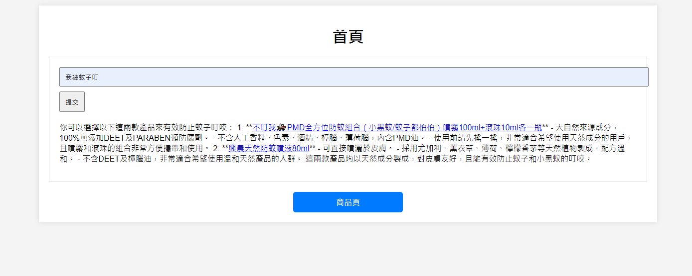

## RAG-product-recommendation
This repository uses the OpenAI API to connect to the Elasticsearch search engine and provide product recommendations to users.

## Purpose
Allow users to input their questions on the front end, search the database based on the users' questions, and respond with suitable products for the users.

## Preparation

1. Install exe [Elasticsearch](https://www.elastic.co/cn/elasticsearch)
2. Install python package: `pip install flask`
3. Start Elasticsearch
4. Run app.py
5. Use `python -m http.server 20000` to start index.html.

## Code Description

### Elasticsearch
- **elast.py**:  
  Read SalePage.csv and input the product names and product descriptions into Elasticsearch.
- **elastSh.py**:  
  Query what values are in Elasticsearch.
- **elashDel.py**:  
  Delete all products in Elasticsearch.
### Produce_html
- **generate_products_html.py**:  
  Generate the front-end homepage, search button, and product page.
- **SalePage.7z**:  
  It contains product data. Please unzip it and use the password to unlock.
### Frontend_Backend
- **api_key.txt**:  
  Store the OpenAI API key, please use your own.
- **app.py**:  
  Use a Flask-written backend to connect to Elasticsearch, send the values returned by Elasticsearch to the OpenAI API for GPT-4, and finally send the values returned by GPT-4 to index.html.
- **index.html**:  
  Front-end homepage
- **products.html**:    
  Product page

